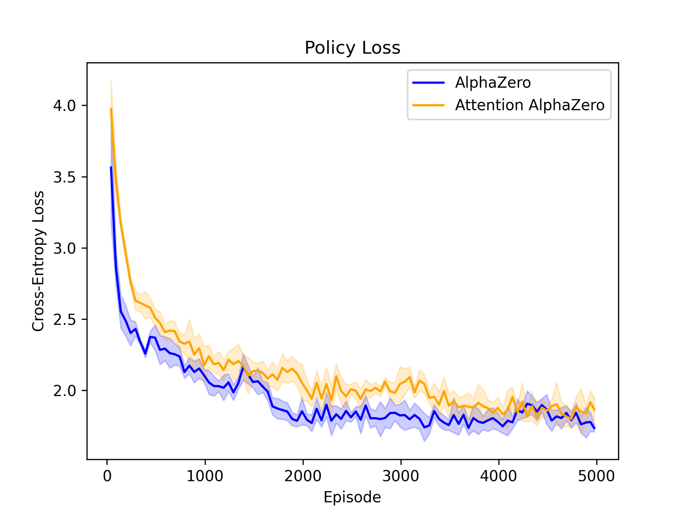
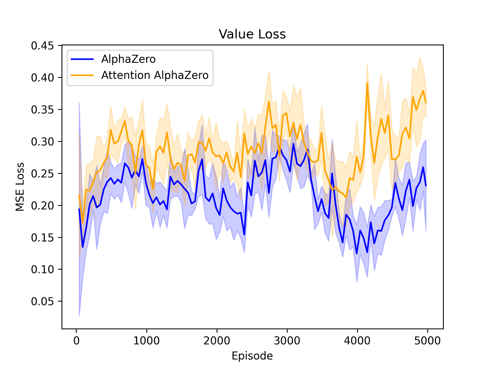
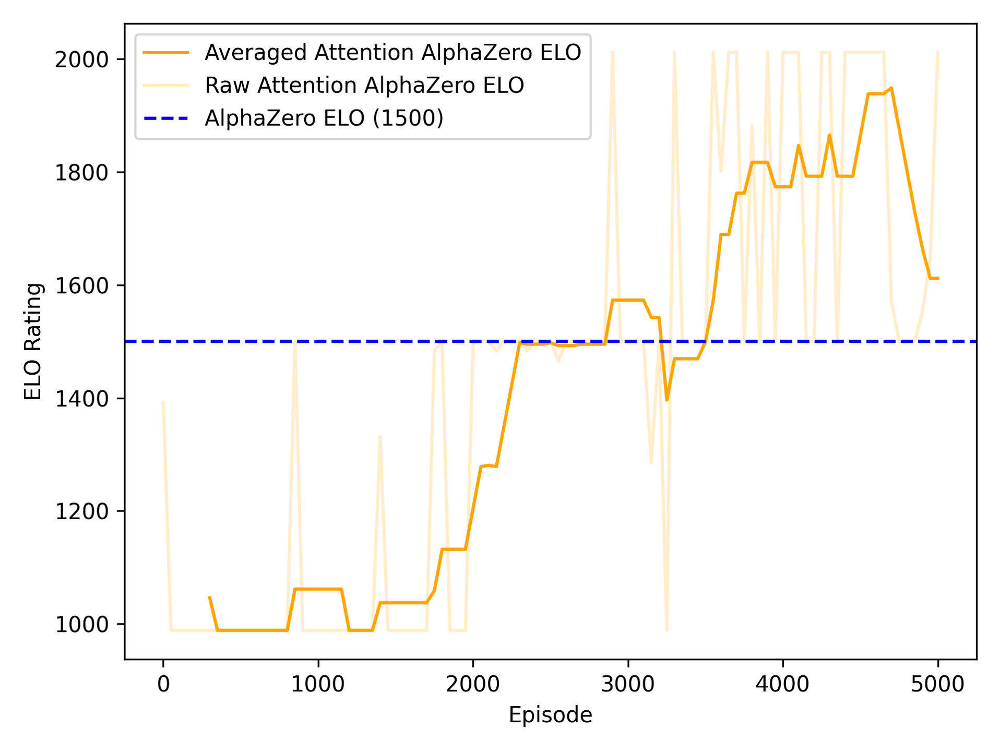

# Gomoku with Attention AlphaZero

> [!NOTE]
> Although the proposed Attention-based AlphaZero model shows superior performance over the vanilla AlphaZero approach,
> further model analysis suggest an attention collapse, exhibiting uniform attention weight values regardless of the inputs.

## Getting Started

In order to run the code, run the following for installing the prerequisites.

```bash
conda create -n <env-name> python==3.10
conda activate <env-name>
pip install -r requirements.txt
```

## Experimental Results

<table>
    <tr>
        <td>
            
            <div align="center">Policy loss convergence</div>
        </td>
        <td>
            
            <div align="center">Value loss convergence</div>
        </td>
    </tr>
</table>


